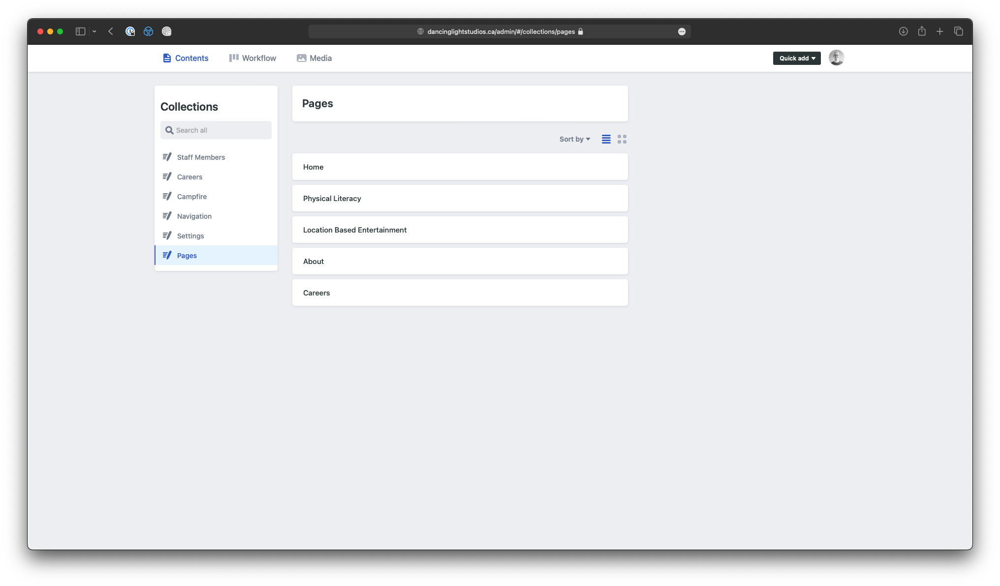
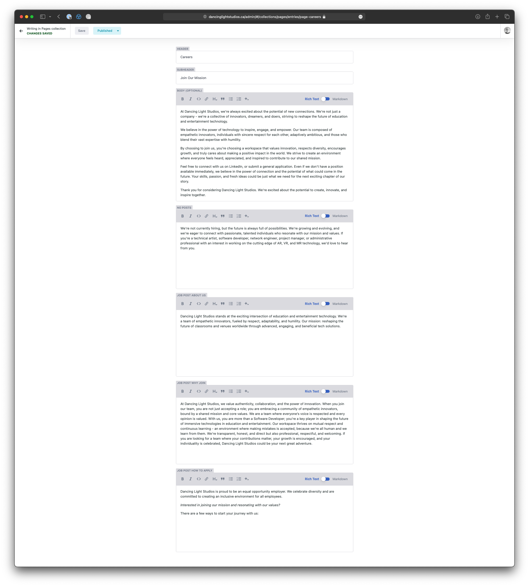
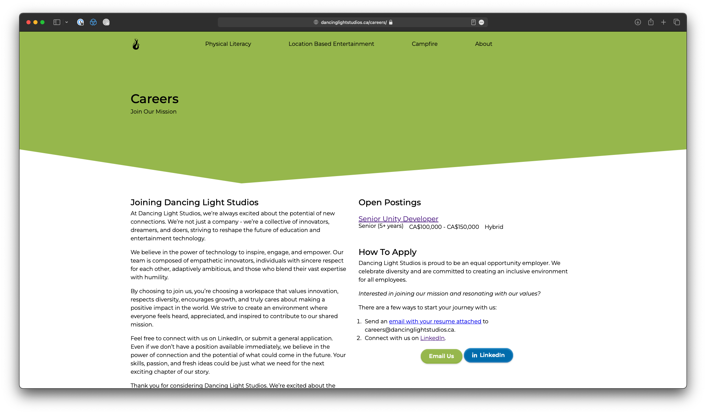

Editing the Careers Page
========================

## 1. Login to the admin area

In your web browser, navigate to [/admin](https://dancinglightstudios.ca/admin)

## 2. Navigate to Pages

From the home page of the admin, click on Pages

## 3. Editing Careers Page

Click on Careers in the main column to open the editor for the careers page.

### 3a. Header

To edit the header of the Careers Page, change the corresponding fields of the Careers Page in the editor.

Look for the fields `HEADER` and `SUBHEADER` which control the text in the green header of the Careers Page on the site.

### 3b. Body

Edit the `BODY` field in the editor to edit the text on the left hand side of the Careers Page

### 3c. No Posts

The `NO POSTS` field in the editor is the text that will appear on the Careers page, if there are no career postings.

### 3d. About Us

The `JOB POST ABOUT US` field in the editor is the text that appears at the top of each career posting titled `About Us`.

### 3e. Why Join DLS

The `JOB POST WHY JOIN` field in the editor is the text that appears at the bottom of each career posting titled `Why Join Dancing Light Studios`.

### 3f. How To Apply

The `JOB POST HOW TO APPLY` field in the editor is the text that appears in 2 places. At the bottom of each career posting, and in the right column of the careers page. 

You should also note, that the text seems cut-off, ending with:

> There are ways to start your journey with us:

This is because, there is a follow up numbered list that is hard coded into the site, with a link to the email (including a populated template), and a link to LinkedIn.