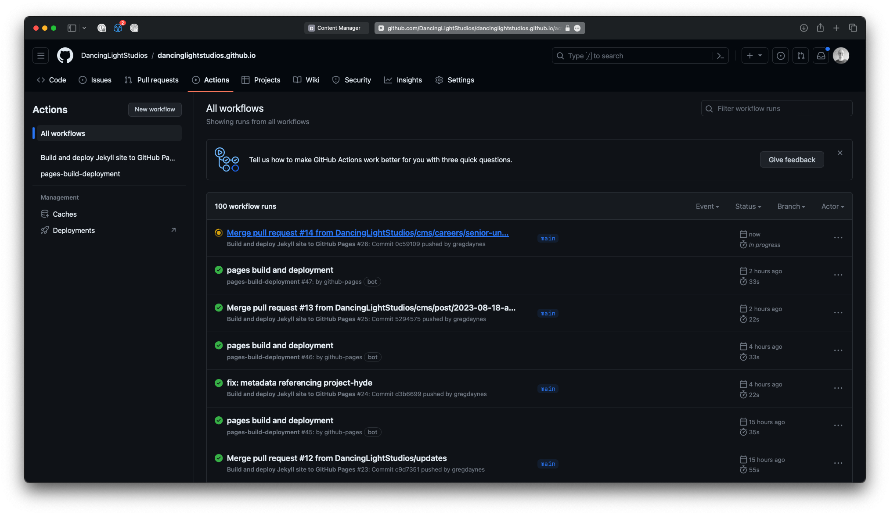

Posting a Career
================

## 1. Login to the admin area

In your web browser, navigate to [/admin](https://dancinglightstudios.ca/admin)

## 2. Navigate to Careers

From the home page of the admin, click on careers

## 3. Create a new Career

### 3a. Click the "New Careers" button at the top right of the main column.

### 3b. Fill out the form on the left with the required information, and optional if desired.

_the preview to the right will be populated as you type_

_in the text area wysiwygs, you can choose from markdown or rich text to format your content_

### 3c. Once you're happy with the content, click save. This will create a [draft PR on Github](https://github.com/DancingLightStudios/dancinglightstudios.github.io/pulls) Which can be reviewed there, or within the Admin area of the website.

## 4. Review, Edit, Publish the new Career

If you decide to take a break, and come back to work on the career posting later, or if you've been asked to review a career posting, the document will appear in the [Workflow](https://dancinglightstudios.ca/admin/#/workflow) section of the admin. 

Click on the card representing the new career you would like to edit.

Once you're done editing, and ready to publish the new career to the website.

### 4a. Set the new career to Published

At the top of the content, click the __Published__ toggle. This is a secondary publishing step (done first of course, to keep you on your toes), and indicates to the content management of the site, to generate the page when it rebuilds. __This does not make the article published yet__

### 4b. Set the new career status to Ready

Next, mark the status of the career to Ready (beside the save button). This may have been done in a previous step, and would be represented in the corresponding column of the workflows area of the admin.

### 4c. Publish that Career!

Now we're ready to publish the career. Click the Publish button at the top of the admin area, Which will dropdown a menu - select "Publish Now".

A confirmation prompt will appear as the last check to make sure you want to publish the career.

### 4d. Published

Once published, the admin area will refresh, and a green Toast bar will say "Entry published"

This kicks off a series of events in Github

## 5. Github

If you've been following along with the content in Github, the PR that matches the new Career you've just published will have been set as "Merged"

Note that various other tags are recorded on the PR to represent it's state as it progressed through the editing and publishing process.

### 5a. Actions

Once the new Career PR has been merged, Github actions will execute 2 sets of actions. This first one is to Build the site to include your new content.

Once the Build is complete, it will start another action to deploy the site to the host.

_If one of these steps fails, there will be an indication as to why, which needs to be corrected before the site can be deployed with your new career post_

Once the second action completes, without error the action will turn green.

## 6. The Site has been updated.

The site should now be up to date, including your new Career page. 

Visit [the careers page](https://dancinglightstudios.ca/careers)

click on the posting to take a look

